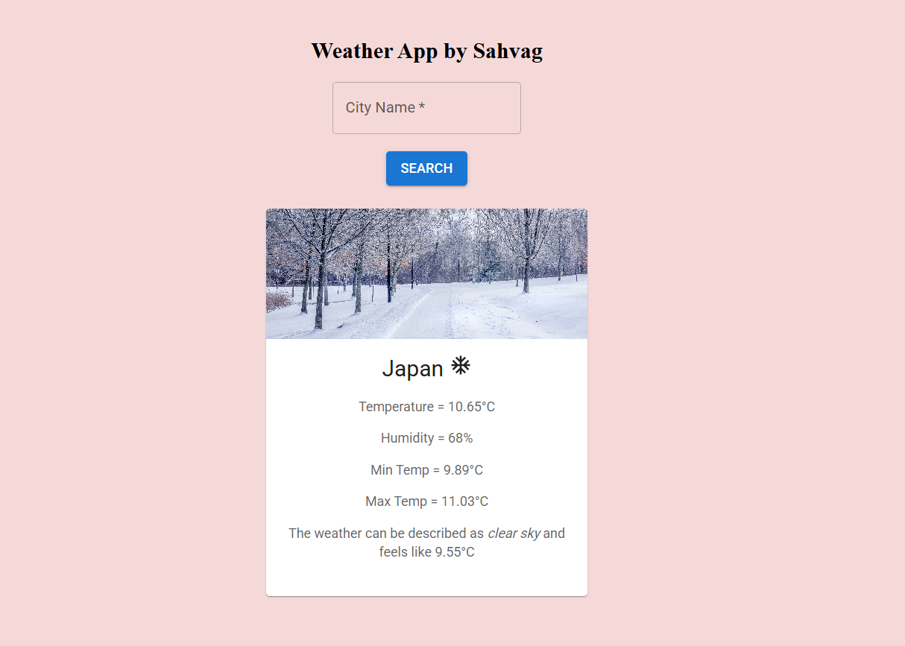

# 🌤️ Weather Widget

## A  React weather widget that shows real-time temperature, humidity, and conditions using the OpenWeather API.

## 📸 Preview

 

## 🚀 Features
- 🌍 Search weather by city name  
- ☀️ Real-time temperature, humidity & weather condition updates  
- 🖼️ Dynamic background or icons based on weather  
- 📱 Responsive and clean UI  

## 🛠️ Tech Stack
- **React.js**  
- **OpenWeather API**  
- **Material UI**
